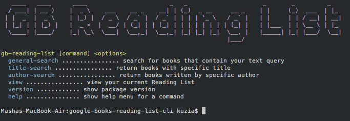
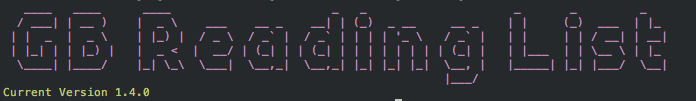
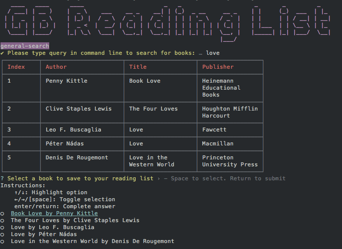
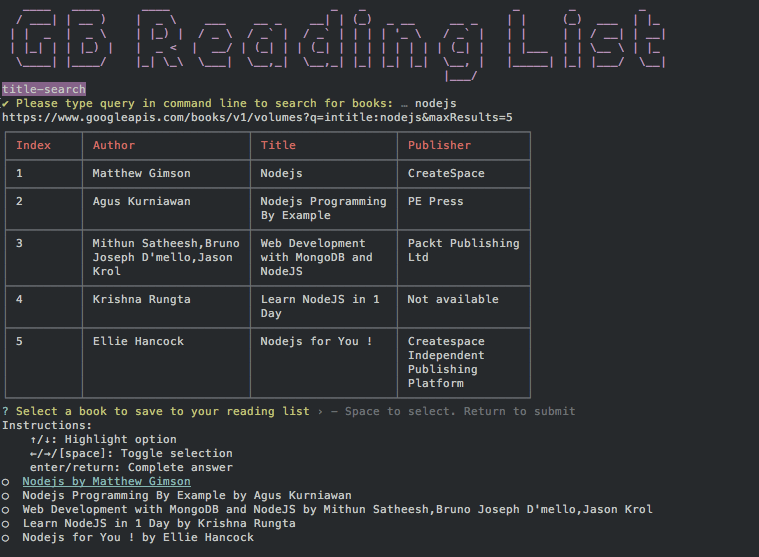
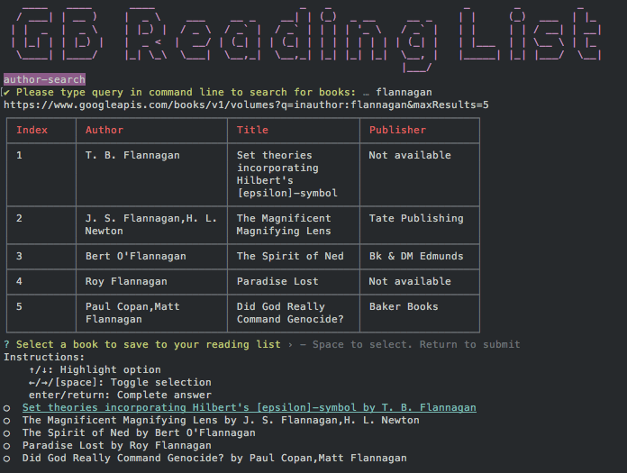
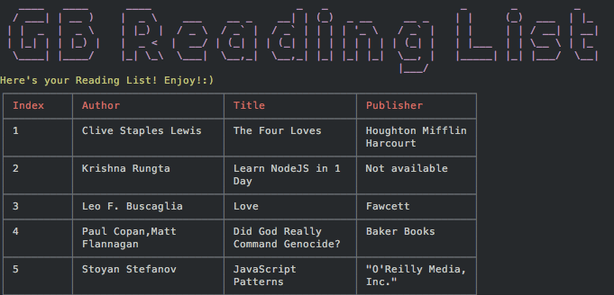

# Google Books Reading List CLI in Node.js

A reading list CLI app in Node.js that allows you to use the Google Books API to search for books and construct a reading list.

## How to build locally

```sh
npm i
npm link OR sudo npm link
```

## Usages

```sh
gb-reading-list
gb-reading-list help
gb-reading-list version
gb-reading-list general-search
gb-reading-list title-search
gb-reading-list author-search
gb-reading-list view
```

## Screenshots

### `main menu`

```sh
gb-reading-list
```

```sh
gb-reading-list help
```

See menu with all available commands and their descriptions.



### `version`

```sh
gb-reading-list version
```

See current version



### `search`

```sh
gb-reading-list general-search
```

Search for books that contain your text query



```sh
gb-reading-list title-search
```

Return books with specific title



```sh
gb-reading-list author-search
```

Return books written by specific author



Then add a book to your reading list

### `view`

```sh
gb-reading-list view
```

View your current reading list



### `test`
```sh
npm test
```
Run Jest unit tests

### `lint`
```sh
npm run lint
```
Run ESLint, a tool for identifying and reporting on patterns found in ECMAScript/JavaScript code.
